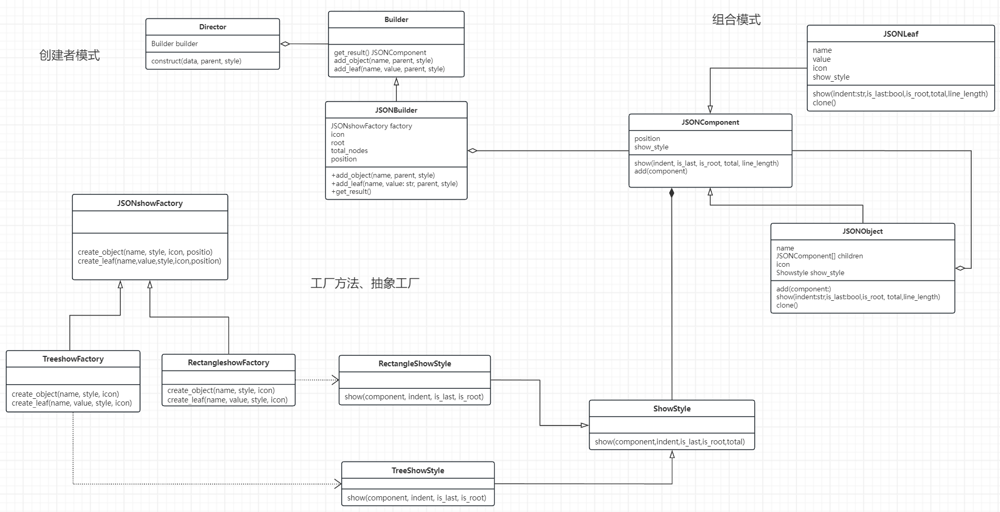

# 设计文档

## 类图

建造者模式中，Buider是Director的一一种属性即has-a的关系（尾部为空心菱形的实线箭头），JSONBuilder是Builder的一个具体实现，继承Builder。
组合模式中 JSONLeaf 和 JSONObject 都继承 Component ，所以 是实线三角头。 同时 JSONObject中 包含 JSONComponent 列表。
工厂模式中 JSONshowFactory 是基类抽象类。而TreeshowFactory 和RectangleshowFactory都是他的具体实现。而这两个工厂对应的产品就是Component中style的两种风格，之间是依赖关系，使用虚线箭头。

#### 设计模式

**工厂方法**（Factory）
定义了一个创建对象的接口，但由子类决定实例化哪一个类。用于处理实现不同输出风格。
创建一个通用的风格输出工厂类 JSONshowFactory。
衍生出具体的风格渲染工厂类 TreeshowFactory 和 RectangleshowFactory。
通过 JSONshowFactory 接口在高层代码中创建对象，无需了解具体实现。

好处：
解耦创建对象的代码和具体实现类。
增加新的风格渲染工厂时，只需增加相应的具体工厂类，无需修改现有代码。

**抽象工厂**（Abstract Factory）
抽象工厂模式提供一个接口，用于创建一系列相关或依赖对象的家族，而无需指定具体类，具体类的实现可以单独实现，然后家族中不同成员对应不同产品。

抽象接口：在 JSONshowFactory 中定义创建相关对象的抽象方法。
具体工厂类如 TreeshowFactory 和 RectangleshowFactory 实现抽象接口，实现了工厂族。
每个具体工厂对应不同ShowStyle 产品。  TreeshowFactory 对应 TreeShowStyle ， RectangleshowFactory 对应 RectangleShowStyle

优点：
提高系统的灵活性和可扩展性。对于不同风格的产品之间进行解耦。
确保创建对象的一致性。

**组合模式**
组合模式将对象组合成树结构，用于表示部分-整体的层次结构，使单个对象和对象组合具有一致性。
组件类：定义抽象基类 JSONComponent，包括通用的操作方法。
叶子节点和中间节点：JSONLeaf 表示叶子节点，JSONObject 表示组合节点，二者都继承自 JSONComponent。
通过统一的接口(JSONComponent)处理节点，同时支持嵌套结构（JSONObject中可以包含 JSONComponent 列表），用户可以一致地使用组合结构中的所有对象。

优点：
简化客户端代码，统一处理单个对象和组合对象，不需要单独判断处理。
提高系统的灵活性和可维护性。

**建造者**（Builder）模式
建造者模式用于一步步创建复杂对象，将对象的构造和表示分离，使同样的构建过程可以创建不同的表示。
Builder：定义抽象类 Builder，包含构建过程的抽象方法。
Concrete Builder：实现具体建造者类 JsonBuilder，负责具体的构建逻辑。构建一棵JSON节点树
Director：Director 类控制建造过程，根据需要调用建造者的方法。construct 函数 负责指挥建造过程。

优点：
分离对象的构造和表示，便于理解和维护。
允许使用相同的构建过程创建不同的对象。

## 其他模式
除了作业必须的几种设计模式，我在实验中还额外关注并满足了以下上课讲授过**SOLID**设计原则

**SRP**  我在每个类或函数中都只实现一种功能。比如对于叶子矩形、叶子树形、树枝矩形、树枝树形四种渲染功能我都分别在四个函数中实现。 这样可以保证更好的进行debug和维护修改。

**OCP**  实现了在不改变现有代码就能够进行扩展功能。比如本次作业中包括  fje.py , Component.py ,style.py , Factory.py ,config.py  。
如果要进行图标族的扩展，则只需要更改config文件，不需要更改其他任何文件，增加图标对即可。
如果要增加风格，则只需要在Factory.py中增加对应的抽象工厂并且在style.py文件中增加具体实现。然后在fje.py  相关函数中增加  Type 选项。

**LSP**  在所有的子类继承父类的实现，所有子类都可以替代父类实现，所有的父类都是以Python中的abs来实现。 如Factory, Component, Showstyle ,Builder类都是用abs来实现的。

**ISP**  大部分的类都是以最小的接口进行实现，不存在子类中对于父类的某种函数的实现为空。 

**DIP**  所有的高层模块都不依赖于底层模块，在作业中所有的继承关系都依赖于一个抽象的父类。  而抽象也都不依赖于具体实现。

