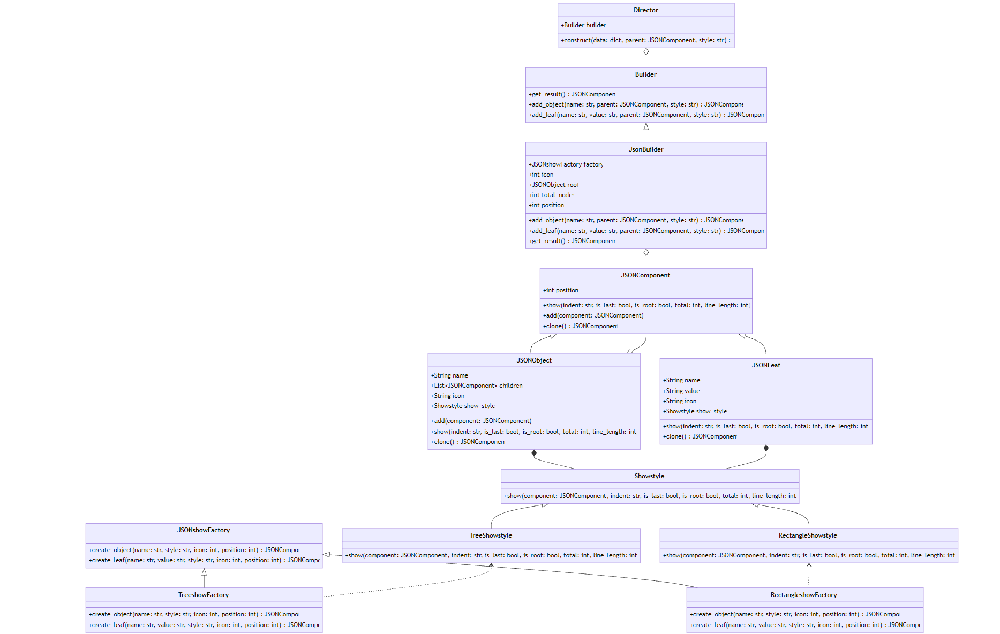

# 设计文档


## 类图

这是使用mermaid进行编写得到的类图。具体mermaid代码见最下方附录。
其中最上面的三个是关于建造者模式，中间三个类是关于组合模式，最下面的两层是关于工厂方法和抽象工厂。
建造者模式中，Buider是Director的一一种属性即has-a的关系（尾部为空心菱形的实线箭头），JSONBuilder是Builder的一个具体实现，继承Builder。
组合模式中 JSONLeaf 和 JSONObject 都继承 Component ，所以 是实线三角头。 同时 JSONObject中 包含 JSONComponent 列表。
工厂模式中 JSONshowFactory 是基类抽象类。而TreeshowFactory 和RectangleshowFactory都是他的具体实现。而这两个工厂对应的产品就是Component中style的两种风格，之间是依赖关系，使用虚线箭头。


#### 设计模式

**工厂方法**（Factory）
定义了一个创建对象的接口，但由子类决定实例化哪一个类。用于处理实现不同输出风格。我们首先创建一个总的风格输出工厂(JSONshowFactory),我们在高层应用时创建对象就直接创建JSONshowFactory 对象，而不加以区分风格，然后衍生出两个具体的风格渲染工厂类。我们在JSONObject 和 JSONLeaf中具有一个属性决定渲染风格，对应着有多个产品。而不同风格则对应不同产品。 高层与底层的调用只需要关注最开始的工厂接口即可，而不需要找到真正得到的工厂。 并且这样的架构，我们在后续增加更多风格渲染工厂，调用者也不需要进行修改调用方式。此外，在每一个风格输出工厂中，还有区分叶子和中间节点。渲染的实现取决于 叶子或者中间节点的style属性。每个style属性都是一种showStyle类。
```
class JSONshowFactory(ABC):
    @abstractmethod
    def create_object(self, name, style, icon, position) -> JSONComponent:
        pass

    @abstractmethod
    def create_leaf(self, name, value, style, icon, position) -> JSONComponent:
        pass
```


**抽象工厂**（Abstract Factory）
接着上面的工厂方法的说明，我们在JSONshowFactory 中实现了抽象接口，用于创建相关或依赖对象的家族，所以我们在高层定义某种风格渲染工厂时，而无需明确知道某种具体类以及指定具体类。而在定义实现抽象工厂时我们不需要考虑具体工厂类的实现，两种具体工厂类则可以彼此之间完全解耦。两种具体工厂 TreeshowFactory 和 RectangleshowFactory，后续如果要增加更多的风格，则只需要增加一个新的抽象工厂以及它的一个具体实现类即可。 比如：
class xxxshowFactory(JSONshowFactory):
    ....

然后实现一个具体的xxxShowStyle。

class TreeShowstyle(Showstyle):
    def show(...):
    ...


```
class TreeshowFactory(JSONshowFactory):
    def create_object(self, name, style, icon, position) -> JSONComponent:
        return JSONObject(name, style, icon, position)

    def create_leaf(self, name, value, style, icon, position) -> JSONComponent:
        return JSONLeaf(name, value, style, icon, position)

class RectangleshowFactory(JSONshowFactory):
    def create_object(self, name, style, icon, position) -> JSONComponent:
        return JSONObject(name, style, icon, position)

    def create_leaf(self, name, value, style, icon, position) -> JSONComponent:
        return JSONLeaf(name, value, style, icon, position)


```


**组合模式**（composite pattern）是一种设计模式，用于将对象组合成树结构以表示部分-整体的层次结构，此模式可以达成单个对象和对象组合的一致性。组合模式在 Python 代码中很常见， 常用于表示与图形打交道的用户界面组件或代码的层次结构。

这里我们的使用JSON文件构建一棵树，所以组合模式是非常适合的。父类是**节点类**(JSONComponent)，每个节点类中有show、clone、以及add生长节点的方法。 子类中有**叶子类** 和**中间节点类**，这两个类的区别在于一个可以继续增加子节点，一个不能。使用组合模式我们就可以忽略这两个的差异性，实现统一接口。这样用户就可以统一的使用组合结构中的所以对象。 忽略差异性之后，一个中间节点中还会有children属性，我们就可以无差别的将它的所有子节点不区分叶子节点和中间节点进行添加。高层调用**JSONComponent类**也更加方便。

```
class JSONComponent(ABC):
    def __init__(self):
        self.position = 0
    @abstractmethod
    def show(self, indent: str = "", is_last: bool = False, is_root: bool = False, total: int = 1, line_length: int = 80) -> str:
        pass

    def add(self, component):
        pass

    @abstractmethod
    def clone(self):
        pass

```


**建造者**（Builder）模式
建造者模式 是一步一步创建一个复杂的对象，它允许用户只通过指定复杂对象的类型和内容就可以构建它们，用户不需要知道内部的具体构建细节。它可以将复杂对象的构造与表示分离，使得同样的构建过程可以创建不同的表现形式。我们首先拥有一个最底层的Builder类，然后JSONBuilder是一个派生出来的JSON建造者类，用于构建JSON结构。它接受渲染工厂和图标作为参数。然后有一个Director类指挥对Builder进行构造。Director类中有一个construct函数。 当然不同的具体建造者类可以进行不同的构造方法。本次作业中我只实现一个FJE小工具，如果后续维护时需要增加对其他格式的进行构建等需求的变化，则可以增加一个新的具体构建者和对应的director类，而不需要更改现有的框架。

```
class Builder(ABC):
    @abstractmethod
    def get_result(self):
        pass

    @abstractmethod
    def add_object(self, name, parent=None, style="tree"):
        pass

    @abstractmethod
    def add_leaf(self, name, value=None, parent=None, style="tree"):
        pass

class JsonBuilder(Builder):
    def __init__(self, factory: JSONshowFactory, icon: int):
        self.factory = factory
        self.icon = icon
        self.root = self.factory.create_object("root", 'tree', icon, 0)
        self.total_nodes = 0
        self.position = 0


class Director:
    def __init__(self, builder: Builder):
        self.builder = builder

    def construct(self, data, parent=None, style="tree"):
```

## 其他模式
除了作业必须的几种设计模式，我在实验中还额外关注并满足了以下上课讲授过**SOLID**设计原则

**SRP**  我在每个类或函数中都只实现一种功能。比如对于叶子矩形、叶子树形、树枝矩形、树枝树形四种渲染功能我都分别在四个函数中实现。 这样可以保证更好的进行debug和维护修改。

**OCP**  实现了在不改变现有代码就能够进行扩展功能。比如本次作业中包括  fje.py , Component.py ,style.py , Factory.py ,config.py  。
如果要进行图标族的扩展，则只需要更改config文件，不需要更改其他任何文件，增加图标对即可。
如果要增加风格，则只需要在Factory.py中增加对应的抽象工厂并且在style.py文件中增加具体实现。然后在fje.py  相关函数中增加  Type 选项。

**LSP**  在所有的子类继承父类的实现，所有子类都可以替代父类实现，所有的父类都是以Python中的abs来实现。 如Factory, Component, Showstyle ,Builder类都是用abs来实现的。

**ISP**  大部分的类都是以最小的接口进行实现，不存在子类中对于父类的某种函数的实现为空。 

**DIP**  所有的高层模块都不依赖于底层模块，在作业中所有的继承关系都依赖于一个抽象的父类。  而抽象也都不依赖于具体实现。


#### 作业提交
1. 设计文档：类图与说明，说明使用的设计模式及作用
2. 运行截图：两种风格，两种图标族，共计4次运行fje的屏幕截图
3. 源代码库：


附录：
类图mermaid代码：
```
classDiagram

    subgraph A
    diretion LR
        class Builder {
        +get_result() JSONComponent
        +add_object(name: str, parent: JSONComponent, style: str) JSONComponent
        +add_leaf(name: str, value: str, parent: JSONComponent, style: str) JSONComponent
    }

    class JsonBuilder {
        +JSONshowFactory factory
        +int icon
        +JSONObject root
        +int total_nodes
        +int position
        +add_object(name: str, parent: JSONComponent, style: str) JSONComponent
        +add_leaf(name: str, value: str, parent: JSONComponent, style: str) JSONComponent
        +get_result() JSONComponent
    }

    class Director {
        +Builder builder
        +construct(data: dict, parent: JSONComponent, style: str) int
    }

    end
    class JSONComponent {
        +int position
        +show(indent: str, is_last: bool, is_root: bool, total: int, line_length: int) str
        +add(component: JSONComponent)
        +clone() JSONComponent
    }

    class JSONObject {
        +String name
        +List~JSONComponent~ children
        +String icon
        +Showstyle show_style
        +add(component: JSONComponent)
        +show(indent: str, is_last: bool, is_root: bool, total: int, line_length: int) str
        +clone() JSONComponent
    }

    class JSONLeaf {
        +String name
        +String value
        +String icon
        +Showstyle show_style
        +show(indent: str, is_last: bool, is_root: bool, total: int, line_length: int) str
        +clone() JSONComponent
    }

    class Showstyle {
        +show(component: JSONComponent, indent: str, is_last: bool, is_root: bool, total: int, line_length: int) str
    }


    class JSONshowFactory {
        +create_object(name: str, style: str, icon: int, position: int) JSONComponent
        +create_leaf(name: str, value: str, style: str, icon: int, position: int) JSONComponent
    }

    class TreeshowFactory {
        +create_object(name: str, style: str, icon: int, position: int) JSONComponent
        +create_leaf(name: str, value: str, style: str, icon: int, position: int) JSONComponent
    }

    class RectangleshowFactory {
        +create_object(name: str, style: str, icon: int, position: int) JSONComponent
        +create_leaf(name: str, value: str, style: str, icon: int, position: int) JSONComponent
    }


    class RectangleShowstyle {
        +show(component: JSONComponent, indent: str, is_last: bool, is_root: bool, total: int, line_length: int) str
    }
    
    class TreeShowstyle {
        +show(component: JSONComponent, indent: str, is_last: bool, is_root: bool, total: int, line_length: int) str
    }

 Director o-- Builder

Builder <.. JsonBuilder


    JSONshowFactory <|--TreeshowFactory

    JSONshowFactory <|-- RectangleshowFactory
    
    JSONObject*--Showstyle

    Showstyle<|--TreeShowstyle
    
    Showstyle<|--RectangleShowstyle 
    TreeShowstyle <.. TreeshowFactory
    RectangleShowstyle<.. RectangleshowFactory
    JSONLeaf*--Showstyle
    JsonBuilder o-- JSONComponent
    JSONComponent <|-- JSONLeaf
    JSONComponent <|-- JSONObject
    JSONObject o--JSONComponent

```
